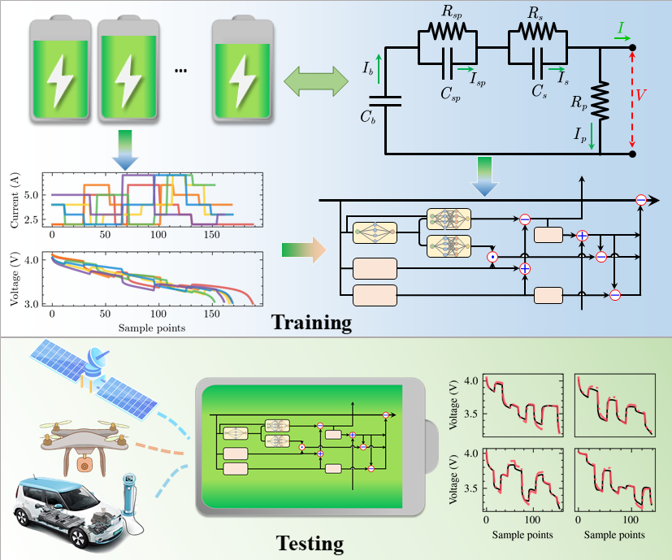

This code is for our paper: [Inherently Interpretable Physics-Informed Neural Network for Battery Modeling and Prognosis](https://ieeexplore.ieee.org/document/10310297)




If you find it useful, please cite our article:
```
@article{wang2023inherently,
  title={Inherently Interpretable Physics-Informed Neural Network for Battery Modeling and Prognosis},
  author={Wang, Fujin and Zhi, Quanquan and Zhao, Zhibin and Zhai, Zhi and Liu, Yingkai and Xi, Huan and Wang, Shibin and Chen, Xuefeng},
  journal={IEEE Transactions on Neural Networks and Learning Systems},
  year={2023},
  publisher={IEEE}
}
```

---

The complete XJTU battery dataset can be found in: [XJTU battery dataset](https://wang-fujin.github.io/).
The data used in this paper is only a small part of it.

---
